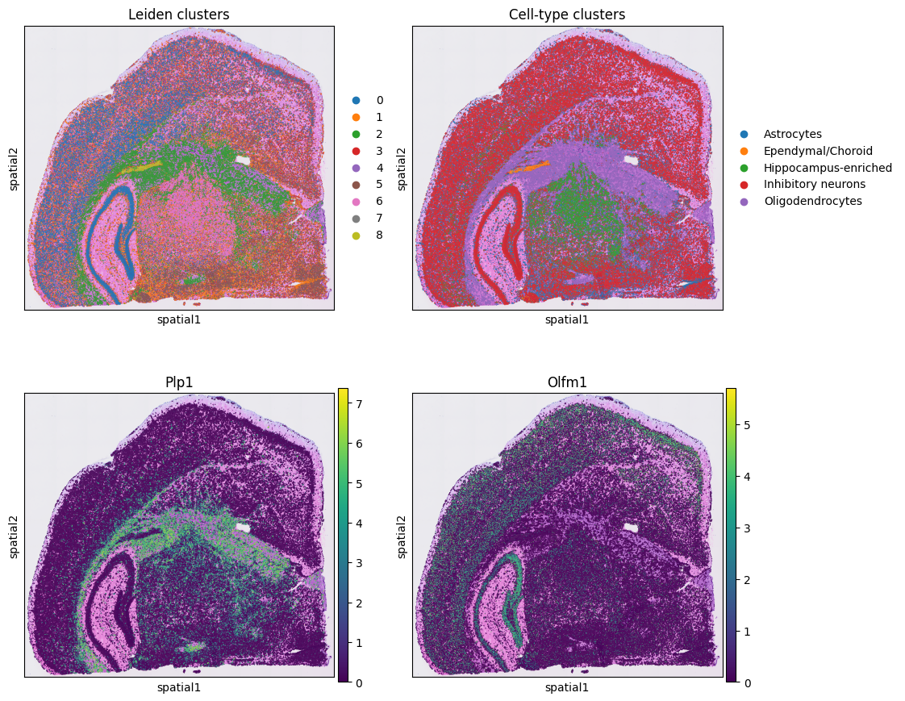

# End-to-End Analysis of 10x Visium HD (8 µm) data in Python (utilizing Squidpy, Scanpy libraries)

Welcome! This guide walks you through an **analysis pipeline** for 10x Visium HD (8 µm bin) data using Python, [Scanpy](https://scanpy.readthedocs.io/), and [Squidpy](https://squidpy.readthedocs.io/).  

- ✅ Import Visium HD data directly from 10x outputs  
- ✅ Perform QC, filtering, normalization, HVG selection  
- ✅ PCA, UMAP, Leiden clustering  
- ✅ Spatial neighborhood statistics (Squidpy)  
- ✅ Plot genes + clusters on tissue  
- ✅ Rank marker genes, visualize expression panels  
- ✅ Annotate clusters using literature-derived marker modules  
- ✅ Export results and generate a Methods text snippet  


> **Tip for beginners**: Each section starts with an explanation of *why* we’re doing it, then gives runnable Python code. Every block of raw code is followed by notes in plain language so you can understand why each step is needed.

---

### 📂 Data Structure

After processing with the 10x Genomics pipeline, your folder should look like this:

```

Visium\_HD\_data/
├── binned\_outputs/
│   └── square\_008um/
│       ├── filtered\_feature\_bc\_matrix.h5
│       └── spatial/
│           ├── tissue\_positions.parquet
│           ├── scalefactors\_json.json
│           ├── tissue\_hires\_image.png
│           └── tissue\_lowres\_image.png

````

- **`filtered_feature_bc_matrix.h5`** → expression matrix (spots × genes)  
- **`tissue_positions.parquet`** → where each spot is located on the tissue  
- **`scalefactors_json.json`** → scaling factors for plotting on histology images  
- **`tissue_hires_image.png` / `tissue_lowres_image.png`** → high/low-resolution histology images  


### ⚙️ Setup environment

We first install and import the necessary Python packages, then define paths so Python knows where to find your data.

```python
# (first time) install:
# !pip install scanpy squidpy anndata h5py pandas numpy matplotlib pillow pyarrow leidenalg

import os, re, json
import numpy as np
import pandas as pd
import scanpy as sc
import squidpy as sq
import matplotlib.pyplot as plt
from PIL import Image

# paths
RUN_DIR = "Visium_HD_data"   # <-- change to your run folder
BIN = "008"                  # '008' for 8 µm
BIN_DIR = os.path.join(RUN_DIR, f"binned_outputs/square_{BIN}um")
SPAT_DIR = os.path.join(BIN_DIR, "spatial")
MATRIX_H5 = os.path.join(BIN_DIR, "filtered_feature_bc_matrix.h5")
lib_id = f"square_{BIN}um"
```

📝 **Notes:**

* Install libraries only once (remove `#` to run the pip command).
* `RUN_DIR` is the folder where your Visium HD data lives.
* The `"008"` means you’re analyzing **8 µm binned data**.
* The rest just builds the correct paths automatically so we don’t have to type them each time.

---

### 📥 Load the count matrix

We now load the gene expression matrix from the `.h5` file into an **AnnData object** (Scanpy’s data format).

```python
adata = sc.read_10x_h5(MATRIX_H5)
adata.var_names_make_unique()
print(adata)
```

📝 **Notes:**

* `sc.read_10x_h5` reads your gene-by-spot count matrix.
* `var_names_make_unique()` avoids errors if two genes share the same name.
* Printing shows you how many spots and genes are loaded.

---

### 🖼️ Add spatial coordinates and images

We attach spatial coordinates, scaling factors, and histology images so later plots can overlay clusters on tissue.

```python
# read positions (parquet present in your folder)
pos = pd.read_parquet(os.path.join(SPAT_DIR, "tissue_positions.parquet"))

# ensure barcode column name & set as index
if "barcode" not in pos.columns:
    pos = pos.rename(columns={pos.columns[0]: "barcode"})
pos = pos.set_index("barcode")

# align to adata.obs_names (handle lane suffix like "-1")
_base = lambda s: s.to_series().str.replace(r"-\d+$", "", regex=True)
if not pos.index.isin(adata.obs_names).all():
    pos.index = _base(pos.index)
    adata.obs["__base"] = _base(adata.obs_names)
    pos = pos.reindex(adata.obs["__base"])
else:
    pos = pos.reindex(adata.obs_names)

# pixel columns expected for HD
pxr, pxc = "pxl_row_in_fullres", "pxl_col_in_fullres"
adata.obsm["spatial"] = np.c_[pos[pxc].to_numpy(), pos[pxr].to_numpy()]  # [x=col, y=row]

# scalefactors + images (file names from your folder)
with open(os.path.join(SPAT_DIR, "scalefactors_json.json"), "r") as fh:
    scales = json.load(fh)
img_hires = np.array(Image.open(os.path.join(SPAT_DIR, "tissue_hires_image.png")))
img_low   = np.array(Image.open(os.path.join(SPAT_DIR, "tissue_lowres_image.png")))

adata.uns["spatial"] = {
    lib_id: {
        "images": {"hires": img_hires, "lowres": img_low},
        "scalefactors": scales,
        "metadata": {},
    },
    "library_id": [lib_id],
}

# (optional) parse grid coords from barcodes for grid neighbors
coords = adata.obs_names.to_series().str.extract(r"s_(\d{3})um_(\d+)_(\d+)(?:-\d+)?$")
coords.columns = ["um","array_row","array_col"]
if coords.notna().all().all():
    adata.obs[["array_row","array_col"]] = coords[["array_row","array_col"]].astype(float).values
```

📝 **Notes:**

* Loads the `tissue_positions.parquet` file = pixel coordinates of each barcode.
* Aligns those coordinates with the barcodes in `adata`.
* Loads high-res and low-res histology images so clusters can be plotted directly on tissue.
* Optional: extracts **grid coordinates** if your barcodes encode them.

---

### 🧪 QC metrics (mitochondrial + ribosomal)

We add basic quality control annotations like % mitochondrial and % ribosomal counts.

```python
# tag mitochondrial (mouse: mt-/mt.) and ribosomal (Rps*/Rpl*)
adata.var["mt"]   = adata.var_names.str.startswith(("mt-","mt."))
adata.var["ribo"] = adata.var_names.str.match(r"^(Rps|Rpl)\d", na=False)

# QC metrics
sc.pp.calculate_qc_metrics(adata, qc_vars=["mt","ribo"], inplace=True)
print("spots:", adata.n_obs, "| genes:", adata.n_vars)
print(adata.obs[["total_counts","n_genes_by_counts","pct_counts_mt","pct_counts_ribo"]].describe().T)

# initial QC violin (safe if keys exist)
qc_keys = [k for k in ["n_genes_by_counts","total_counts","pct_counts_mt","pct_counts_ribo"] if k in adata.obs.columns]
if qc_keys:
    sc.pl.violin(adata, qc_keys, jitter=0.3, multi_panel=True)
```

📝 **Notes:**

* Tags mitochondrial (`mt-`) and ribosomal (`Rps`, `Rpl`) genes.
* Calculates per-spot QC metrics like:

  * total counts
  * genes detected
  * % mitochondrial
  * % ribosomal
* Violin plots help spot outliers (spots with too few counts, or too high % mito).

---

### 🧹 Adaptive filtering

We filter out low-quality spots and genes using thresholds based on your dataset’s distribution.

```python
# dataset-adaptive thresholds from percentiles
low, high = adata.obs['total_counts'].quantile([0.02, 0.99])
min_counts = max(100, int(low))
max_counts = max(int(high), 30000)
print(f"Using min_counts={min_counts}, max_counts={max_counts}")

sc.pp.filter_cells(adata, min_counts=min_counts)
sc.pp.filter_cells(adata, max_counts=max_counts)

# relaxable mito/ribo caps
if 'pct_counts_mt' in adata.obs:
    adata = adata[adata.obs['pct_counts_mt'] < 25].copy()
if 'pct_counts_ribo' in adata.obs:
    adata = adata[adata.obs['pct_counts_ribo'] < 30].copy()

sc.pp.filter_genes(adata, min_counts=10)

# recompute QC after subsetting & replot
adata.var["mt"]   = adata.var_names.str.startswith(("mt-","mt."))
adata.var["ribo"] = adata.var_names.str.match(r"^(Rps|Rpl)\d", na=False)
sc.pp.calculate_qc_metrics(adata, qc_vars=["mt","ribo"], inplace=True)

print("Remaining spots:", adata.n_obs, "| genes:", adata.n_vars)
qc_keys = [k for k in ["n_genes_by_counts","total_counts","pct_counts_mt","pct_counts_ribo"] if k in adata.obs.columns]
if adata.n_obs > 0 and qc_keys:
    sc.pl.violin(adata, qc_keys, jitter=0.3, multi_panel=True)
else:
    print("⚠️ Skipping violin plot: no spots or missing QC keys.")
```

📝 **Notes:**

* Uses **2nd and 99th percentiles** of total counts to avoid extreme low/high spots.
* Caps mitochondrial reads at 25% and ribosomal at 30%.
* Removes genes expressed in <10 spots.
* Recomputes QC metrics and replots.

---

### 🔎 Normalize, log-transform, HVGs, PCA, UMAP, clustering

We normalize counts, select highly variable genes, and compute PCA, neighbors, UMAP, and Leiden clusters.

```python
sc.pp.normalize_total(adata, target_sum=1e4)
sc.pp.log1p(adata)

sc.pp.highly_variable_genes(adata, n_top_genes=3000, flavor="seurat_v3")
adata = adata[:, adata.var.highly_variable].copy()

sc.pp.pca(adata, n_comps=50)
sc.pp.neighbors(adata, n_neighbors=15, n_pcs=30)
sc.tl.umap(adata)

import leidenalg  # ensure installed
sc.tl.leiden(adata, resolution=0.8, key_added="leiden_bin")
adata.obs["cluster"] = adata.obs["leiden_bin"].astype("category")

sc.pl.umap(adata, color=["cluster","total_counts","pct_counts_mt"], wspace=0.4)
sc.pl.spatial(adata, color="cluster", library_id=lib_id, spot_size=1.2)
```

📝 **Notes:**

* Normalization scales each spot to the same total counts.
* Log transform stabilizes variance.
* Selects **3000 highly variable genes (HVGs)**.
* PCA reduces data to 50 components.
* Neighbor graph + UMAP visualizes the data.
* Leiden finds clusters (resolution 0.8).
* Plots show clusters on UMAP and on tissue.

---

### 🕸️ Spatial neighbors and enrichment

We build a spatial graph to see which clusters sit next to each other.

```python
# grid neighbors for HD squares if array coords exist; else generic
try:
    if {"array_row","array_col"}.issubset(adata.obs.columns):
        sq.gr.spatial_neighbors(adata, coord_type="grid", n_neighs=4, n_rings=1)
    else:
        sq.gr.spatial_neighbors(adata, coord_type="generic", n_neighs=8)
except Exception:
    sq.gr.spatial_neighbors(adata, coord_type="generic", n_neighs=8)

sq.gr.nhood_enrichment(adata, cluster_key="cluster")
sq.pl.nhood_enrichment(adata, cluster_key="cluster")

sq.gr.co_occurrence(adata, cluster_key="cluster")
seed_cluster = adata.obs["cluster"].cat.categories[0] if "cluster" in adata.obs and adata.n_obs > 0 else None
if seed_cluster is not None:
    sq.pl.co_occurrence(adata, cluster_key="cluster", clusters=seed_cluster, figsize=(8,4))
```

📝 **Notes:**

* Creates a neighbor graph based on spatial grid or generic nearest neighbors.
* Tests **which clusters are enriched next to each other** (nhood enrichment).
* Co-occurrence shows how often clusters appear side by side in space.

---

### 🎨 Spatial gene and cluster maps

We can overlay specific genes and clusters directly on the tissue.

```python
sq.pl.spatial_scatter(
    adata,
    color=["Olfm1","Plp1", "cluster"],
    library_id=lib_id,
    size=1.2
)
```

📝 **Notes:**

* Plots expression of example genes (`Olfm1`, `Plp1`) and the cluster labels overlayed on top of the tissue.
* Lets you visually check if gene expression matches known tissue layers.

---

### 🧬 Marker gene discovery

Finds cluster marker genes and visualizes them with summary plots.

```python
# rank markers
sc.tl.rank_genes_groups(adata, "cluster", method="t-test")

# overview plots
sc.pl.rank_genes_groups(adata, n_genes=10, sharey=False)
sc.pl.rank_genes_groups_heatmap(adata, n_genes=10, groupby="cluster", show_gene_labels=True)

# top N genes per cluster → ordered list
rg_df = sc.get.rank_genes_groups_df(adata, group=None) \
          .sort_values(["group","pvals_adj","scores"], ascending=[True, True, False])
topN = 6
top_df = rg_df.groupby("group", as_index=False, sort=False).head(topN)
ordered_genes = top_df.groupby("group")["names"].apply(list).explode().drop_duplicates().tolist()

# dotplot + heatmap
sc.pl.dotplot(adata, var_names=ordered_genes, groupby="cluster", standard_scale="var", dendrogram=False)
sc.pl.heatmap(adata, var_names=ordered_genes, groupby="cluster",
              swap_axes=True, vmin=-2, vmax=2, cmap="viridis", show_gene_labels=True)
```

📝 **Notes:**

* Uses `rank_genes_groups` to identify markers for each cluster.
* Generates bar plots, heatmaps, and dotplots for quick inspection.
* Helps decide which biological identity each cluster may represent.

---

### 🧬 Cluster annotation with marker panels

To interpret clusters biologically, we can compare them against known **cell type marker genes**.

```python
# Minimal marker panels (edit/expand to match your tissue & regions of interest)
marker_sets = {
    "Excitatory neurons": ["Slc17a7","Slc30a10","Tbr1","Cux1","Cux2","Rorb","Foxp2","Reln"],
    "Inhibitory neurons": ["Gad1","Gad2","Slc6a1","Pvalb","Sst","Vip","Reln"],
    "Oligodendrocytes":  ["Mbp","Plp1","Mog","Cnp","Cldn11"],
    "OPCs":              ["Pdgfra","Cspg4","Tnr"],
    "Astrocytes":        ["Aqp4","Gfap","Aldh1l1","Slc1a3"],
    "Microglia":         ["C1qa","C1qb","Cx3cr1","Tyrobp","P2ry12"],
    "Endothelial":       ["Kdr","Pecam1","Klf2","Cldn5","Rgs5"],
    "Ependymal/Choroid": ["Foxj1","Ttr","Krt18"],
    "Hippocampus-enriched": ["Prox1","Zbtb20","Itpka","Calb2","Pcp4"]
}

# Score each set (Scanpy’s AddModuleScore equivalent)
for name, genes in marker_sets.items():
    present = [g for g in genes if g in adata.var_names]
    if len(present) == 0:
        # keep columns aligned even if nothing matched
        adata.obs[f"score_{name}"] = 0.0
        continue
    sc.tl.score_genes(adata, present, score_name=f"score_{name}", use_raw=False)

# Average scores per Leiden cluster
cluster_key = "cluster"  # or your SR graphclust labels if you prefer
score_cols = [c for c in adata.obs.columns if c.startswith("score_")]
avg_scores = adata.obs.groupby(cluster_key)[score_cols].mean()

# Assign each cluster to the top-scoring class
best_class = avg_scores.idxmax(axis=1).str.replace("^score_", "", regex=True)
# Make a tidy mapping and apply it
mapping = {cl: lbl for cl, lbl in zip(best_class.index.astype(str), best_class.values)}
adata.obs[f"{cluster_key}_annot"] = adata.obs[cluster_key].astype(str).map(mapping).astype("category")

# Quick look
display(avg_scores.style.background_gradient(cmap="viridis"))
print("Cluster → annotation:\n", mapping)

# Plots with annotations
sc.pl.umap(adata, color=[cluster_key, f"{cluster_key}_annot"], wspace=0.4)
sc.pl.spatial(adata, color=f"{cluster_key}_annot", library_id=lib_id, spot_size=1.2)

# Optional: show a few marker panels on tissue
sq.pl.spatial_scatter(
    adata,
    color=["Olfm1","Plp1", f"{cluster_key}_annot"],
    library_id=lib_id,
    size=1.2
)
```

📝 **Notes:**

* Each **marker set** is a gene panel known to define a cell type.
* We compute a “score” per spot = how much that spot expresses the panel.
* Scores are averaged per cluster → whichever marker set is highest becomes that cluster’s label.
* UMAP + spatial plots help validate whether the annotations make sense.

---

### 🔹 Visualizing Gene Expression and Cluster Annotations Side-by-Side

In this step, we want to compare how **Leiden-based clusters** (unsupervised clustering) look against **manually annotated clusters** (based on tissue-specific marker genes).
We’ll overlay both clusters on the tissue image alongside expression of marker genes (*Olfm1* and *Plp1*). This helps us validate whether the automatic clusters correspond to known biology.


```python
# --- Ensure required cluster columns exist ---
# 'cluster' column should contain Leiden clustering results
if "cluster" not in adata.obs and "leiden_bin" in adata.obs:
    adata.obs["cluster"] = adata.obs["leiden_bin"].astype("category")

cluster_key = "cluster"                  # Leiden clusters
annot_col   = f"{cluster_key}_annot"     # Annotated clusters from marker genes

assert cluster_key in adata.obs.columns,  "❌ Missing Leiden cluster column."
assert annot_col   in adata.obs.columns,  f"❌ Missing annotated cluster column."

# --- Row 1: Show gene expression & Leiden clusters ---
sq.pl.spatial_scatter(
    adata,
    color=["Olfm1", "Plp1", cluster_key],  # two genes + Leiden clusters
    library_id=lib_id,
    size=1.2,
    ncols=3,
    title=["Olfm1", "Plp1", "Leiden clusters"]
)

# --- Row 2: Show gene expression & Annotated clusters ---
sq.pl.spatial_scatter(
    adata,
    color=["Olfm1", "Plp1", annot_col],    # two genes + Annotated clusters
    library_id=lib_id,
    size=1.2,
    ncols=3,
    title=["Olfm1", "Plp1", "Annotated clusters"]
)

# --- Optional: Direct side-by-side comparison of clusters only ---
sq.pl.spatial_scatter(
    adata,
    color=[cluster_key, annot_col],
    library_id=lib_id,
    size=1.2,
    ncols=2,
    title=["Leiden clusters", "Annotated clusters"]
)
```

📝 ***Notes:***

1. **Cluster Types**

   * *Leiden clusters* = generated automatically from gene expression patterns.
   * *Annotated clusters* = manually labeled based on marker genes (e.g., hippocampus, cortex, etc.).

2. **Why show both?**

   * If *Olfm1* or *Plp1* expression lines up with an annotated cluster, it validates the biology.
   * If the Leiden clustering disagrees, you may need to adjust clustering resolution or re-check marker assignments.

3. **Visualization layout**

   * First row = Leiden clusters next to *Olfm1*/*Plp1*.
   * Second row = Annotated clusters next to *Olfm1*/*Plp1*.
   * Last plot = Leiden vs Annotated clusters directly side by side.

---

### 🧾 Methods blurb (for reports/papers)

```python
METHODS_TEXT = """
Preprocessing followed the Scanpy spatial tutorial workflow:
https://scanpy-tutorials.readthedocs.io/en/latest/spatial/basic-analysis.html
Briefly, we computed QC metrics (including mitochondrial and ribosomal fractions),
performed adaptive filtering, library-size normalization, log1p transform, HVG selection,
PCA, neighborhood graph construction, UMAP, and Leiden clustering.

Cluster annotation was guided by external resources:
- Allen Brain Atlas: https://mouse.brain-map.org/experiment/thumbnails/100048576?image_type=atlas
- Mouse Brain Gene Expression Atlas (Linnarson lab): http://mousebrain.org/
- Preprint reference: https://www.biorxiv.org/content/10.1101/2020.07.24.219758v1

We generated module scores for literature-derived marker sets (astrocytes, oligodendrocytes, OPCs,
microglia, endothelial, inhibitory/excitatory neurons, hippocampus-enriched, etc.), averaged per
cluster, and assigned labels by the top-scoring class. Labels can be refined by inspecting
individual marker genes and spatial context.
"""
print(METHODS\_TEXT)

````

### 💾 Save processed object  

```python
OUT = os.path.join(RUN_DIR, f"visium_hd_{BIN}um_processed.h5ad")
adata.write(OUT, compression="gzip")
print("Saved:", OUT)
````

📝 **Notes:**

* Saves your final AnnData object (`.h5ad`) with all QC, clustering, and annotations.
* Use this file to reload results later without rerunning the pipeline.

---

### 📚 Important Citations

* [Scanpy spatial tutorial](https://scanpy-tutorials.readthedocs.io/en/latest/spatial/basic-analysis.html)
* [Allen Brain Atlas](https://mouse.brain-map.org/)
* [Mouse Brain Atlas — Linnarson Lab](http://mousebrain.org/)
* [Spatial transcriptomics preprint](https://www.biorxiv.org/content/10.1101/2020.07.24.219758v1)
* Wolf et al., *Genome Biology*, 2018 (Scanpy)
* Palla et al., *Nature Methods*, 2022 (Squidpy)

